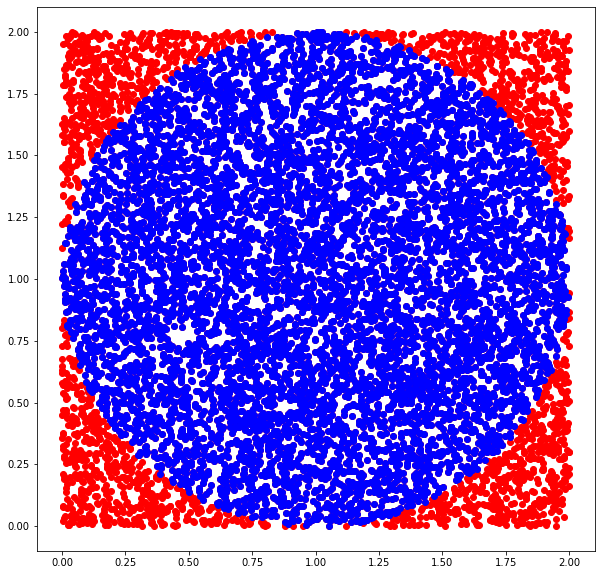

Calculating value of pi in python.

pi_simulation.py
-------------------

In this we calculate the value of pi using simulation.
Idea : We take one 2 by 2 square and draw a circle such that it's radius is 1 and throw darts on it.
Calculation : Value of pi is equal to the number of darts fall on circle divided by total number of darts.



```
input: N=100_000

output: The value of pi as calculated from simulation: 3.14228
```
